This handbook walks you through setting up your first AI agent in Trillet. From creating call flows to assigning numbers and handling live calls, you'll learn each step to get your agent running smoothly.

<Note>
**Ready to scale beyond the basics?** Our platform supports complete white-label customization - imagine your own branded domain, custom email notifications, and workspaces that reflect your unique brand identity. Perfect for agencies and enterprises looking to offer AI voice solutions under their own name. [Explore Whitelabel](https://app.trillet.ai/settings) to unlock unlimited branding possibilities.
</Note>

<Tip>
Looking for advanced whitelabel features? Our [Exclusive Whitelabel Guide](https://app.trillet.ai/) contains premium strategies and configurations - available exclusively to Whitelabel subscribers.
</Tip>

## Getting Started

Once you sign in, you'll land on your Home Page. To build an AI agent, the first step is creating a Call Flow.

1. **Access the Side Panel**: Hover over and click the Trillet logo. This will open the Side Panel.

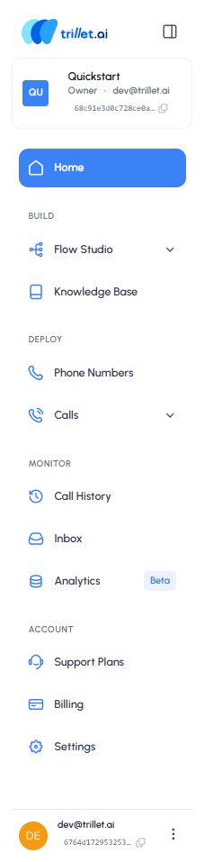


2. **Navigate the Interface**: From the Side Panel, you can navigate to all sections of the Trillet interface. Each section has its own functionality, which we'll explore as we move through this handbook.

3. **Start with Flow Studio**: 
   - In the Side Panel, click **Flow Studio**
   - This will open a dropdown menu with two options: [Call Flows](/v1/api-reference/endpoints/flows/call-flows/create) and [Message Flows](/v1/api-reference/endpoints/flows/message-flows/create)

4. **Choose Your Flow Type**: Trillet lets you create both, depending on your use case. In this module, we'll start with a Call Flow.

### Understanding Call Flows

A Call Flow is the backbone of your AI agent. It defines how conversations are structured and whether your agent will handle one-way or two-way communication. You can think of it like a blueprint for your agent's calls.

After navigating to Call Flows, your dashboard will look like this:

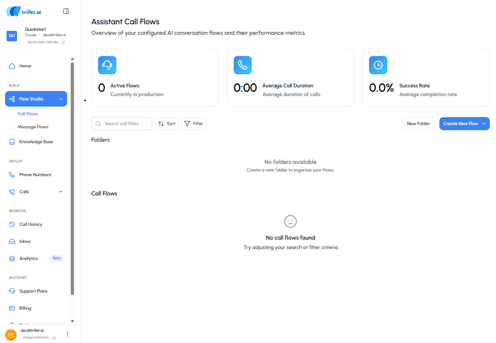


- As you create call flows, they'll appear here for quick access
- You can also add personal folders to keep your work organized

To begin building your first flow, click the **Create New Flow** button.

## 1.1 Create a Call Flow from Scratch

Trillet gives you the ability to customize your agent and choose how it communicates with users.

On this page, you'll set the foundation for your AI agent by giving it a name, defining its purpose, and selecting the right call direction, voice, and language model. Think of this as your agent's "identity card" - the details you set here define how it looks, sounds, and behaves during conversations.

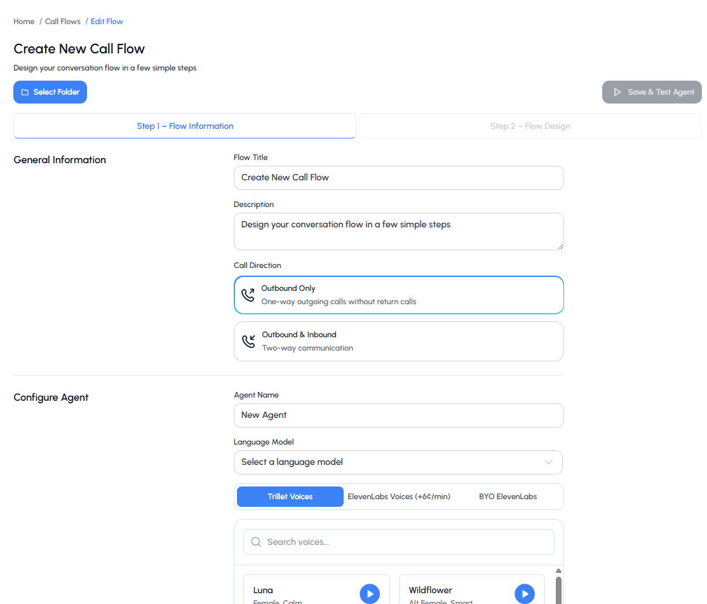


### Configuration Steps

**Select Folder**
- Choose the folder where you want to save this call flow
- Organizing flows into folders helps keep your workspace tidy

**Enter Flow Information**
- **Flow Title**: Give your call flow a descriptive name (e.g., Sales Demo Flow)
- **Description**: Add a short explanation of what this flow is for (optional, but useful if you have multiple flows)
- **Call Direction**:
  - **Outbound Only**: one-way outgoing calls without return calls
  - **Outbound & Inbound**: two-way conversations where the agent can also receive calls

Select the option that matches your use case.

**Configure Your Agent**
- **Agent Name**: Assign a name to your agent. This is how it will appear across your workspace
- **Language Model**: Select the AI model that powers your agent's responses (see [Call Agents API](/v1/api-reference/endpoints/agents/call/create) for available models)
- **Voice Options**: Choose from available voices:
  - Trillet AI Voices (default, included)
  - ElevenLabs Voices (premium, additional cost)
  - BYO ElevenLabs (bring your own ElevenLabs account) [You will need to ensure that you have added the voices to your ElevenLabs account first under 'My Voices' and that the necessary privileges are provided to the API key.]
- **Flow Generator**: Trillet gives you the ability to turn an existing call recording into a ready-to-use call flow

Once you've filled in the details, click **Next** (bottom right) to move on to prompting your agent.

## 1.2 Prompting Your Agent

The way you prompt your agent determines how well it performs during conversations. Think of it like giving instructions to a teammate before they step into a meeting - the clearer and more specific you are, the better they'll handle the interaction.

You can also choose how your agent starts off the call — whether that's waiting for the caller to speak first, using an AI-generated greeting that adapts to context, or delivering a custom greeting you've written yourself.

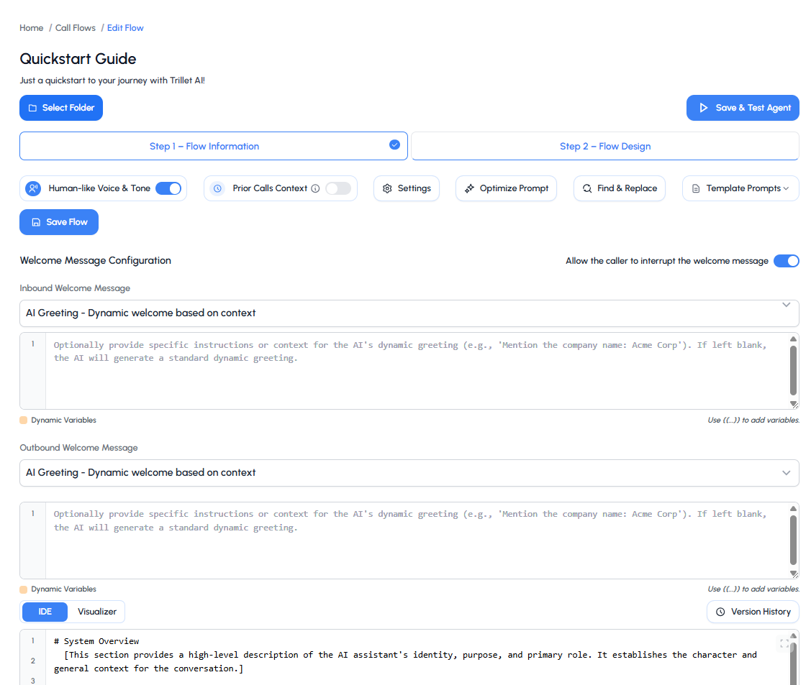


### Writing Effective Prompts

A strong prompt usually includes:
- **A clear goal** → what is the agent trying to achieve on this call?
- **Background context** → who is the agent, and what key details should they know?
- **Conversation flow** → the step-by-step path the agent should follow to reach the goal

### Using the Prompt Template

To make this easier, Trillet provides a prompt template you can follow. Instead of starting from scratch, the template gives you a ready-made structure that covers all the essentials: defining your agent's role, setting formatting rules, and mapping out the conversation flow.

**Example Prompt Structure:**
If your agent's goal is to qualify leads for a demo, your prompt might:
- Set the goal as confirming interest and booking a demo slot
- Provide background context like "You are Alex, a friendly sales assistant from Acme Software"
- Outline a conversation flow where the agent greets the lead, confirms their availability, and suggests two demo times

### Testing Your Agent

    You can test your agent through both **Voice Chat** and **Text Chat**. **Voice Chat** lets you experience how it sounds in a live call, while **Text Chat** makes it easy to review responses in writing. Both methods allow you to fine-tune your prompt and improve the agent's performance.

<div className="flex flex-col lg:flex-row items-start gap-6">
  <div className="flex-shrink-0">
    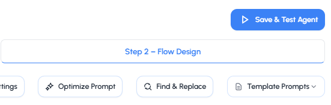
    
  </div>
  <div className="flex-1">
    <p>
    When you're ready to test, click the **Save & Test Agent** button in the top-right corner of the prompt editor.
    </p>
  </div>
</div>

    You can test your agent through both **Voice Chat** and **Text Chat**:

<div className="flex flex-col lg:flex-row items-start gap-6">
  <div className="flex-shrink-0">
    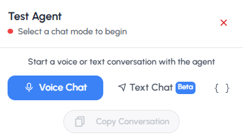
    
  </div>
  <div className="flex-1">
    <p>
    - **Voice Chat** lets you experience how it sounds in a live call
    - **Text Chat** makes it easy to review responses in writing

    Both methods allow you to fine-tune your prompt and improve the agent's performance.
    </p>
  </div>
</div>

<Note>
It's always a good idea to test your prompt with different variations to see what gives you the most natural results.
</Note>

## 1.3 Assigning a Phone Number

When you're ready to take your AI agent live, it needs a phone number that people can call. Assigning a number is what connects your agent to the outside world, allowing it to handle real conversations instead of just test runs.

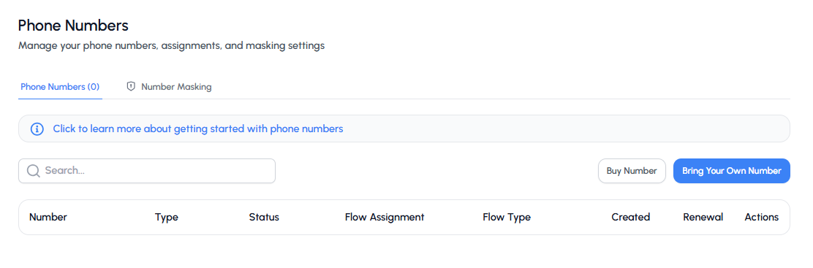


### Number Options

Trillet gives you two options:

**1. Buy a New Number**
- Purchase directly through the platform
- Quick setup and ready to use right away
- Search by country, type (local or toll-free), state, or area code

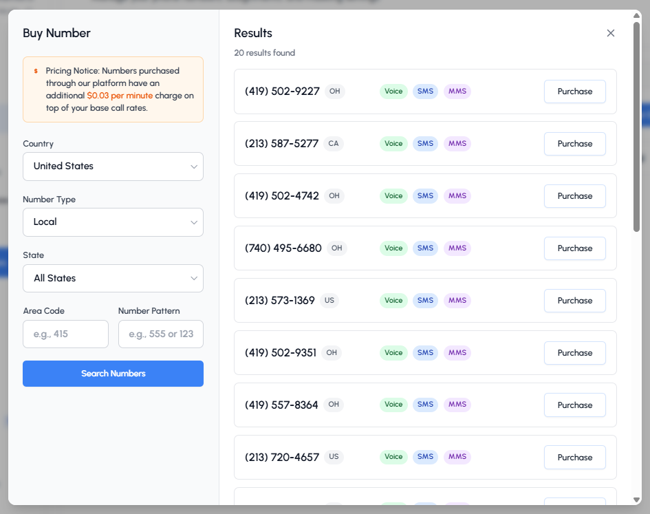


**2. Bring Your Own Number**
- Link an existing number from providers like Twilio
- Keep using your existing carrier rates
- Manage everything from within Trillet

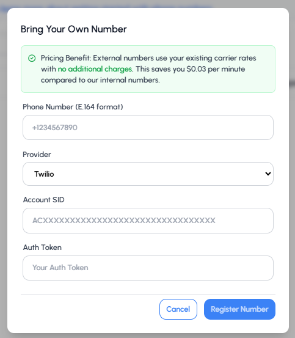


### Number Assignment

Once you have a number, you can assign it to your AI agent:

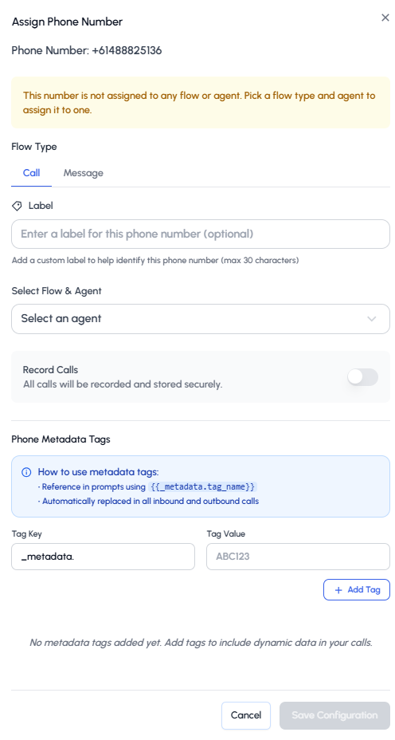


Configuration options include:
- Choose whether to assign to a call or message flow
- Select the agent it should connect with
- Enable call recording
- Add metadata tags for dynamic interactions

### Next Steps After Assignment

Once your number is linked, you can configure:
- Maximum call duration
- Call recording settings
- Business hours
- Call or Message flow assignment

When everything is configured, your number is live and ready. Make a quick test call to confirm everything works as expected.

## 1.4 Sending and Receiving Calls

Once a phone number is assigned to your AI agent, you can configure how it handles incoming and outgoing calls.

### Single Calls

To assign a single number: go to **Sidebar → Calls → Single Call**

Simply select the agent you want to map the number to (the same agent you assigned the phone number to) and enter the number where you'd like to receive the calls.

You can also use our [Voice Calls API](/v1/api-reference/endpoints/calls/initiate-call) to programmatically initiate calls:

```bash
curl -X POST https://api.trillet.ai/api/v1/calls/send \
  -H "Authorization: Bearer YOUR_API_KEY" \
  -H "Content-Type: application/json" \
  -d '{
    "agentId": "your_agent_id",
    "toNumber": "+1234567890",
    "fromNumber": "your_assigned_number"
  }'
```

### Batch Calls

Trillet also gives you the ability to place batch calls. To access this feature: **Sidebar → Calls → Batch Calls**

Batch Calls let you reach multiple contacts at once instead of dialing them individually. This is especially helpful for:
- Lead reactivation campaigns
- Appointment reminders
- Survey collection
- Follow-up calls

**Setup Process:**
1. Select an agent
2. Upload a CSV file with contact details
3. Schedule when the calls should go out
4. Review past batches under "View History" to track performance

<Tip>
For large-scale operations, consider using our [Batch Calls API](/v1/api-reference/endpoints/calls/batch/overview) to programmatically manage batch calls and monitor their status.
</Tip>

## 1.5 Setting up Transfers

Transfers let your agent hand a call over to a real person or another system when needed. This is useful for situations where the conversation requires human support, a specialized team, or a different department.

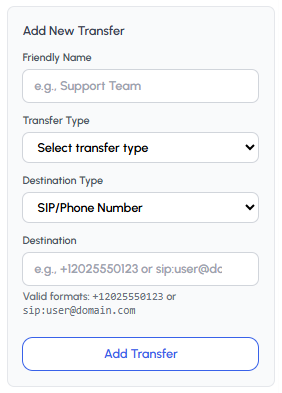


### Transfer Setup Steps

1. **Click Add New Transfer**
2. **Enter a friendly name** (e.g., Support Team)
3. **Select the transfer type**
4. **Choose the destination type** (Phone Number/SIP Address or Phone Metadata Tags)
5. **Enter the destination** in the valid format:
   - Phone: `+12025550123`
   - SIP: `sip:user@domain.com`
6. **Save your transfer** - your agent will now know where to route calls when triggered

### Transfer Types

- **Warm Transfer**: Agent stays on the line during handoff
- **Cold Transfer**: Agent immediately transfers and disconnects

<Warning>
Make sure to test your transfer destinations to ensure they're properly configured and accessible.
</Warning>

## API Integration

Throughout this guide, we've focused on the visual interface, but every feature is also available through our comprehensive REST API:

<Columns cols={2}>
  <Card
    title="Call Agents API"
    icon="robot"
    href="/v1/api-reference/endpoints/agents/call/create"
  >
    Create and manage conversational agents programmatically
  </Card>
  <Card
    title="Call Flows API"
    icon="diagram-project"
    href="/v1/api-reference/endpoints/flows/call-flows/create"
  >
    Design conversation flows via API
  </Card>
  <Card
    title="Voice Calls API"
    icon="phone"
    href="/v1/api-reference/endpoints/calls/initiate-call"
  >
    Initiate and manage calls programmatically
  </Card>
  <Card
    title="Conversations API"
    icon="comments"
    href="/v1/api-reference/endpoints/conversations/generateMessage"
  >
    Handle real-time conversations
  </Card>
</Columns>

## Next Steps

Now that you've set up your first AI agent, explore these advanced features:

<Columns cols={2}>
  <Card
    title="Exclusive Whitelabel Guide"
    icon="building"
    href="https://app.trillet.ai/"
  >
    Scale your implementation with whitelabel tools
  </Card>
  <Card
    title="Analytics & Monitoring"
    icon="chart-line"
    href="https://app.trillet.ai/calls/analytics"
  >
    Track performance and optimize your agents
  </Card>
  <Card
    title="Advanced Prompting [Soon!]"
    icon="wand-magic-sparkles"
  >
    Learn advanced prompting techniques for better conversations
  </Card>
  <Card
    title="Platform Integrations"
    icon="webhook"
    href="/platform-integrations"
  >
    Connect your agent to external systems
  </Card>
</Columns>

## Support & Resources

<Columns cols={3}>
  <Card
    title="API Documentation"
    icon="book"
    href="/v1/api-reference/introduction"
  >
    Complete API reference and examples
  </Card>
  <Card
    title="Community"
    icon="users"
    href="https://www.skool.com/trillet-ai"
  >
    Join our developer community
  </Card>
  <Card
    title="Support"
    icon="headset"
    href="https://app.trillet.ai/support-plans"
  >
    Get a support plan for direct technical help and guidance
  </Card>
</Columns>